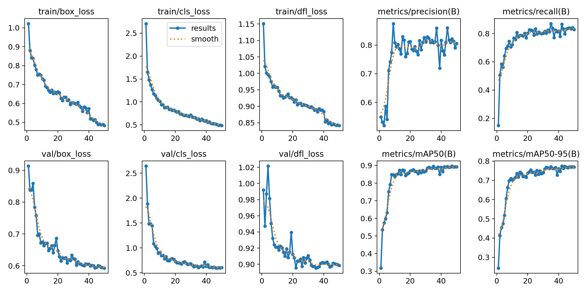

# AutoGreen
Progetto per la creazione di una serra autosufficiente (completamente automatizzato).

## Modello 1

Il sistema sarà composto da un Raspberry Pi 3 Model B che fungerà da unità centrale di controllo e analisi. Il Raspberry gestirà un microcontrollore collegato, responsabile del controllo diretto del motore e della fotocamera. Le immagini acquisite verranno inviate dal microcontrollore al Raspberry, dove verranno effettuate le operazioni di elaborazione e analisi. 

### Struttura Meccanica e Hardware

####  Componenti Principali Hardware:

- **Microcontrollore**:
  - **Esp-S3**, per il controllo del Motore stepper e della fotocamera.
  - **Raspberry Pi3 Model B**, Per la gestine dei vari microcontrollori ed esecuzione di task.
- **Attuatori**:
  - **Motore Stepper Nema 17 17hs15-1504sx1**, Motore che serve per alzare e abbassare la piastra che contiene la fotocamera.
- **Sensori**:
  - **Fotocamera OV2460**, Esegue le foto che verranno inviate al raspberry.

#### Struttura Meccanica

La parte meccanica consisterà in una piastra che conterrà il microcontrollore, gli attuatori e la fotocamera.
verrà attaccata ad un asta attraverso una ruota dentata.

### Software e Programmazione

#### Principale software da implementare:

- **Gestione del Motore Stepper**, software per la gestione del movimento del motore.
- **Gestione della fotocamera**, software per l'esecuzione della foto.
- **Gestione invio dati**, software per l'invio dei dati.
- **Modello per riconoscere le piante**, Modello di AI per il riconoscimento di un oggetto(nel nostro caso una pianta).

## Setup

### Install 

1. git clone git@github.com:FabioPic92/AutoGreen.git

### Core

#### Build

1. cd AutoGreen/Core
2. mkdir build
3. cd build
4. cmake ..
5. make

questo genererà i file eseguibili per i vari nodi

#### Install Paho Library

La libreria va installata in locale sia per C che C++

Versione C

1. git clone https://github.com/eclipse-paho/paho.mqtt.c.git
2. cd paho.mqtt.c
3. cmake -B build -DPAHO_BUILD_STATIC=ON -DPAHO_BUILD_SHARED=OFF -DPAHO_BUILD_SAMPLES=OFF -DPAHO_ENABLE_TESTING=OFF
4. cmake --build build

Nella cartella build/src dovresti trovare i file .a (es. libpaho-mqtt3as.a)

Versione C++

1. git clone https://github.com/eclipse/paho.mqtt.cpp
2. cd paho.mqtt.cpp
3. git submodule init
4. git submodule update
5. cmake -Bbuild -H. -DPAHO_WITH_MQTT_C=ON -DPAHO_BUILD_EXAMPLES=ON
6. sudo cmake --build build/ --target install

#### Tips

Nel caso non trovasse i file .so e .a in ogni terminale in cui lanciate un nodo con paho eseguite lo script:

1. ./configure.sh

#### Install Opencv

sudo apt install libopencv-dev python3-opencv

### Model Install

1. cd Model
2. source Modelenv/bin/activate
3. pip install -r requirements.txt

# Core

TO-DO

# Model

Il primo modello scelto avrà lo scopo di riconoscere se una pianta di pomodorini sarà matura o no.
Il dataset scelto è quello di loboro Ai, nel nostro caso si è scelto il subdataset little tomato(http://assets.laboro.ai.s3.amazonaws.com/laborotomato/laboro_tomato_little.zip).
Questo Dataset è composto da immagini di piante di pomodorini e da un file json che indica la quantità e lo stato di maturazione(l_fully_ripened l_half_ripened, l_green) in un file json.
Purtroppo il dataset è piccolo(289 immagini per il training e 70 per il test) ma visto che le etichette di cui abbiamo bisogno sono poche(nello specifico 3) per ora va bene.

Fasi per l'addestramento:
1. Studio Modello 
2. Pre-processing Dataset
3. Training Model
4. Test Model

### Studio modello 
Per ora si è scelto il modello YOLOv5 in quanto soddisfa le nostre necessità.
In futuro si pensa di sviluppare un proprio modello

### Pre-Processed Dataset
Come detto precedentemente il dataset è composto da foto di dimensioni quali: 3024x4032, 3120x4160.
Mentre la fotocamera OV2640 ha risoluzione 1600x1200.
In quanto il modello ho necessiatà di foto quadrata andiamo a modificare le immagini ad una size di 1280x1280.
In secondo luogo abbiamobisogno di un set per la validazione perciò si andrà a creare 2 set Train e Val a partire dal set di Train.
Per convenzione si andrà a fare una divisone 80/20 dove 80 è il train e il 20 e il set di validazione.

Codice:

TO-DO

### Training Model
Per eseguire l'addestramento bisogna trasformare il dataset da coco a Yolo:
Di seguito i passaggi:

1. Creazione labels nel file convert_to_yolo.py

TO-DO

2. Creazione file yaml in generate_yaml.py

TO-DO

Di seguito si procede con il training:
Il modello base è 

TO-DO

### Test Model
Il test sui risultati è stato fatto con il set test:\

TO-DO

### Risultati

Di seguito riporto i risultati del primo training.

[Scarica il file CSV](Model/result/results.csv)

I risultati finali ottenuti sono:
| **Metrica**    | **Valore** |
|----------------|------------|
| Precisione     | 0.80521    |
| Recall         | 0.82732    |
| mAP@50         | 0.89262    |
| mAP@50-95      | 0.769      |

Per ora sono buoni, bisogna fare altri test per capire se c'è bisogno di migliorare.

## Licenza

Questo progetto è distribuito con la licenza MIT.
