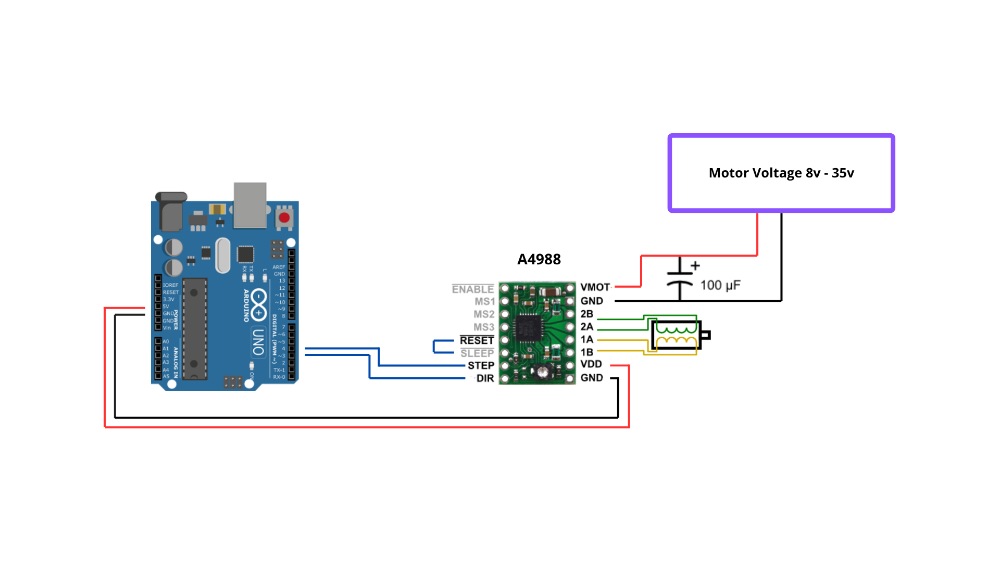
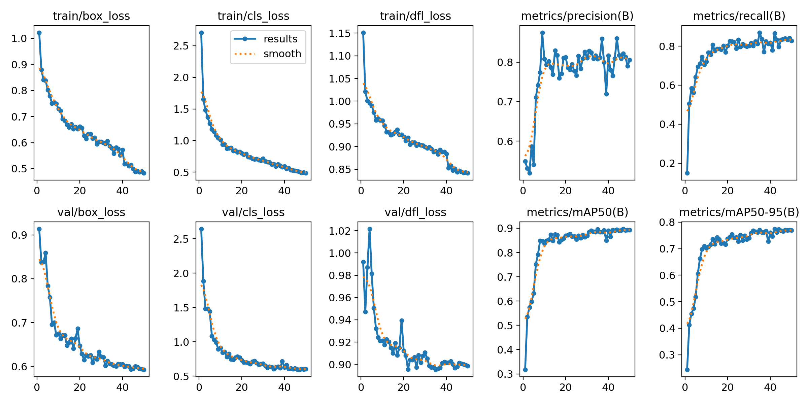

# AutoGreen
Progetto per la creazione di una serra autosufficiente(completamente automatizzato).

## Modello 1 v0.1

Il sistema sarà composto da un Raspberry Pi 3 Model B che fungerà da unità centrale di controllo e analisi. Il Raspberry gestirà 2  microcontrollori, uno responsabile del controllo del motore e unno per la gestione fotocamera. Le immagini acquisite verranno inviate dal microcontrollore al Raspberry, dove verranno effettuate le operazioni di elaborazione e analisi. 

### Struttura Meccanica e Hardware

####  Componenti Principali Hardware:

- **Microcontrollore**:
  - **Arduino Uno R4**, per il controllo del Motore stepper.
  - **Esp32-S3 Camera**, per la gestione della fotocamera.
  - **Raspberry Pi3 Model B**, Per la gestine dei vari microcontrollori ed esecuzione di task.
- **Attuatori**:
  - **Motore Stepper Nema 17 17hs15-1504sx1**, Motore che serve per alzare e abbassare la piastra che contiene la fotocamera.
- **Sensori**:
  - **Fotocamera OV2460**, Esegue le foto che verranno inviate al raspberry.

#### Struttura Meccanica

La parte meccanica consisterà in una piastra che conterrà il Esp32-S3 Camera.
Verrà attaccata ad un vite trapezoidale che verrà fatta girare con il motore stepper.

### Software e Programmazione

#### Principale software da implementare:

- **Gestione del Motore Stepper**, software per la gestione del movimento del motore.
- **Gestione della fotocamera**, software per l'esecuzione della foto.
- **Gestione invio dati**, software per l'invio dei dati.
- **Modello per riconoscere le piante**, Modello di AI per il riconoscimento di un oggetto(nel nostro caso una pianta).

## Setup

### Install 

1. git clone git@github.com:FabioPic92/AutoGreen.git

### Core

#### Build

1. cd AutoGreen/Core
2. mkdir build
3. cd build
4. cmake ..
5. make

questo genererà i file eseguibili per i vari nodi

#### Install Paho Library

La libreria va installata in locale sia per C che C++

Versione C

1. git clone https://github.com/eclipse-paho/paho.mqtt.c.git
2. cd paho.mqtt.c
3. cmake -B build -DPAHO_BUILD_STATIC=ON -DPAHO_BUILD_SHARED=OFF -DPAHO_BUILD_SAMPLES=OFF -DPAHO_ENABLE_TESTING=OFF
4. cmake --build build

Nella cartella build/src dovresti trovare i file .a (es. libpaho-mqtt3as.a)

Versione C++

1. git clone https://github.com/eclipse/paho.mqtt.cpp
2. cd paho.mqtt.cpp
3. git submodule init
4. git submodule update
5. cmake -Bbuild -H.  -DPAHO_BUILD_STATIC=ON -DPAHO_BUILD_SHARED=OFF -DPAHO_WITH_MQTT_C=ON -DPAHO_BUILD_EXAMPLES=ON
6. sudo cmake --build build/ --target install

#### Tips

Nel caso non trovasse i file .so e .a in ogni terminale in cui lanciate un nodo con paho eseguite lo script:

1. ./configure.sh

#### Install Opencv

sudo apt install libopencv-dev python3-opencv

### Model Install

1. cd Model
2. source Modelenv/bin/activate
3. pip install -r requirements.txt

# Core

TO-DO

### Motore

La parte centrale comunica con il motore utilizzando la versione open source EMQX del protocollo MQTT 

# Motore

### Componenti

1. Motore Stepper - Nema17 17hs15-1504sx1
2. Arduino Uno r4 wifi
3. Microstepping Bipolar Stepper Motor Driver - A4988
4. Condensatore 100uF 50v

### Collegamento



## Dati Motore

1. Step: uint16_t, numero step
2. Duration: uint16_t, tempo di step
3. Direction: enum { FORWARD, REVERSE }, direzione motore

## Struttura Dati

### Tipo di task

```cpp
enum TypeTask {
    MOVE,
    IDLE
};
```

### Vettore circolare(Queue)

```cpp
const int sizeVector = 10;

class Queue {
private:
    Task m_vecQueue[sizeVector];
    int m_indexWrite;
    int m_indexRead;

public:
    Queue()
    : m_indexWrite(0), m_indexRead(0)
    {}

    bool writeTask(Task newTask) {
      if(isEmpty()){
        m_vecQueue[m_indexWrite] = newTask;
        m_indexWrite = (m_indexWrite + 1) % sizeVector;
      }
      return false;
    }

    Task readTask() {
        if(m_indexWrite != m_indexRead)
        {
            Task task = m_vecQueue[m_indexRead];
            m_indexRead = (m_indexRead + 1) % sizeVector;
            return task;
        }
        return Task();
    }

    bool isEmpty() {
      return m_indexWrite == m_indexRead;
    }
};
```

### Schedule

Lo schedule viene usate per gestire i vari tipi di messaggio che ricevo. I messaggio vengono messi in una coda e vengono processati.

```cpp
class Schedule{
private:
    Queue m_queue;
public:
    Schedule() {
        Schedule::instance = this;
    }

    void AddTask(const Task& task) {
        m_queue.writeTask(task);
    }

    Task RemoveTask() {
        return m_queue.readTask();
    }

    bool isEmpty() {
        return m_queue.isEmpty();
    } 

    bool execute() {
        while(!m_queue.isEmpty()){
            Task task = RemoveTask();
            task.execute();
            Serial.println("Remove");
        }
        return true;
    }

    void updateSchedule(uint16_t step, uint16_t duration, Direction dir) {
        int iStep = static_cast<int>(step);
        int iDuration = static_cast<int>(duration);
        MotorStepper motorStpper(iStep, iDuration, dir); 
        Task task(TypeTask::MOVE, motorStpper);
        Serial.println("Add");
        AddTask(task);
    }

    static void handleMqttMessage(uint16_t step, uint16_t duration, Direction dir) {
        if (instance != nullptr) {
            instance->updateSchedule(step, duration, dir);
        }
    }

private:
    static Schedule* instance;
};

Schedule* Schedule::instance = nullptr;
```

## Gestione Messaggi

La gestione dei dati avviene utilizzando il protocollo MQTT, nello specifico in arduino viene utilizzata la libreria PubSubClient.
```cpp

#include <WiFi.h>
#include <PubSubClient.h>

const char* ssid = "";
const char* password = "";

const char* mqttServer = "192.168.180.85";
const int mqttPort = 1883;
const char* mqttUser = "admin";
const char* mqttPassword = "public";

typedef void (*MessageCallback)(uint16_t step, uint16_t duration, Direction direction);

String getMacAddress() {
    uint8_t mac[6];
    WiFi.macAddress(mac); 
    char macStr[18];   
    snprintf(macStr, sizeof(macStr),
             "%02X:%02X:%02X:%02X:%02X:%02X",
             mac[0], mac[1], mac[2], mac[3], mac[4], mac[5]);
    return String(macStr);
}

class Omqx {
private:
    WiFiClient espClient;
    PubSubClient client;

    uint16_t m_receivedSpeed = 0;
    uint16_t m_receivedDuration = 0;
    Direction m_receivedDirection;

    static MessageCallback userCallback;

public:
    Omqx() : client(espClient) 
    {
    }

    void begin() {
        setupWifi();
        client.setServer(mqttServer, mqttPort);
        client.setCallback(callbackWrapper);
    }

    void setupWifi() {
        delay(10);
        Serial.println("\nConnecting to WiFi...");
        WiFi.begin(ssid, password);

        while(WiFi.status() != WL_CONNECTED) {
            delay(500);
            Serial.print(".");
        }
        Serial.println(WiFi.localIP());
    }

    void reconnect() {
        while(!client.connected()) {
            Serial.println("Connetting to broker MQTT...");
            String clientId = "Motor-" + getMacAddress();
            if (client.connect(clientId.c_str(), mqttUser, mqttPassword)) {
                Serial.println("Connected!");
                subscribe("core/Motor");
            } else {
                Serial.print(client.state());
                delay(5000);
            }
        }
    }

    void subscribe(const char* topic) {
        if(client.connected()) {
            client.subscribe(topic);
            Serial.print("Subscribe on topic: ");
            Serial.println(topic);
        }
    }

    void publish(const char* topic, const char* message) {
        if(client.connected()) {
            client.publish(topic, message);
            Serial.print("Pubblic on");
            Serial.print(topic);
            Serial.print(": ");
            Serial.println(message);
        }
    }

    void loop() {
        if(!client.connected()) {
            reconnect();
        }
        client.loop();
    }

    int getSpeed() const { return m_receivedSpeed; }
    int getDuration() const { return m_receivedDuration; }
    Direction getDirection() const { return m_receivedDirection; }

    static void setMessageCallback(MessageCallback cb) {
        userCallback = cb;
    }

private:

    static void callbackWrapper(char* topic, byte* payload, unsigned int length) {
        instance->handleCallback(topic, payload, length);
    }

    void handleCallback(char* topic, byte* payload, unsigned int length) {
        Serial.print("Messagge receive on topic: ");
        Serial.println(topic);

        uint16_t step = payload[0] | (payload[1] << 8);
        uint16_t duration = payload[2] | (payload[3] << 8);
        uint8_t directionVal = payload[4];    

        m_receivedSpeed = step;
        m_receivedDuration = duration;
        m_receivedDirection = (directionVal == 0) ? FORWARD : REVERSE;

        if (userCallback) {
            userCallback(step, duration, (directionVal == 0) ? FORWARD : REVERSE);
        }
    }

    static Omqx* instance;

public:
    static void setInstance(Omqx* inst) {
        instance = inst;
    }
};

Omqx* Omqx::instance = nullptr;
MessageCallback Omqx::userCallback = nullptr;
```

# Camera

TO-DO

# Model

Il primo modello scelto avrà lo scopo di riconoscere se una pianta di pomodorini sarà matura o no.
Il dataset scelto è quello di loboro Ai, nel nostro caso si è scelto il subdataset little tomato(http://assets.laboro.ai.s3.amazonaws.com/laborotomato/laboro_tomato_little.zip).
Questo Dataset è composto da immagini di piante di pomodorini e da un file json che indica la quantità e lo stato di maturazione(l_fully_ripened l_half_ripened, l_green) in un file json.
Purtroppo il dataset è piccolo(289 immagini per il training e 70 per il test) ma visto che le etichette di cui abbiamo bisogno sono poche(nello specifico 3) per ora va bene.

Fasi per l'addestramento:
1. Studio Modello 
2. Pre-processing Dataset
3. Training Model
4. Test Model

### Studio modello 
Per ora si è scelto il modello YOLOv8 in quanto soddisfa le nostre necessità.
In futuro si pensa di sviluppare un proprio modello

### Pre-Processed Dataset
Il dataset è composto da foto di dimensioni quali: 3024x4032, 3120x4160.
Mentre la fotocamera OV2640 ha risoluzione 1600x1200.
In quanto il modello ho necessiatà di foto quadrate andiamo a modificare le immagini ad una dimensione di 1280x1280.
In secondo luogo abbiamo bisogno di un set per la validazione perciò si andrà a creare 2 set, Train e Val, a partire dal set di Train.
Per convenzione si andrà a fare una divisone 80/20 dove 80 è il train e il 20 è il set di validazione.

Codice:

TO-DO

### Training Model
Per eseguire l'addestramento bisogna trasformare il dataset da coco a Yolo.
Di seguito i passaggi:

1. Creazione labels nel file convert_to_yolo.py

TO-DO

2. Creazione file yaml in generate_yaml.py

TO-DO

Di seguito si procede con il training:
Il modello base è 

TO-DO

### Test Model
Il test sui risultati è stato fatto con il set test:\

TO-DO

### Risultati

Di seguito riporto i risultati del primo training.


[Scarica il file CSV](Model/result/results.csv)

I risultati finali ottenuti sono:
| **Metrica**    | **Valore** |
|----------------|------------|
| Precisione     | 0.80521    |
| Recall         | 0.82732    |
| mAP@50         | 0.89262    |
| mAP@50-95      | 0.769      |

Per ora sono buoni, bisogna fare altri test per capire se c'è bisogno di migliorare.


## Licenza

Questo progetto è distribuito con la licenza MIT.
